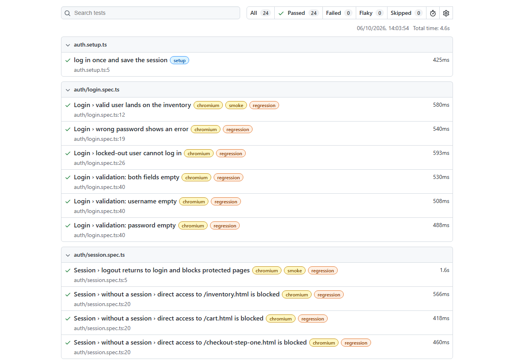

# Playwright E2E Framework

[](https://github.com/FrancoDuperre/playwright-e2e-framework/actions/workflows/e2e.yml)

A maintainable end-to-end test framework for an e-commerce flow (login, product sorting, cart and checkout), built with Playwright and TypeScript against the public [SauceDemo](https://www.saucedemo.com) practice store.

## What's inside

- **Page Object Model** with locators based on the app's `data-test` attributes (no XPath, no fixed sleeps)
- **Custom fixtures** (`test.extend`) that inject page objects, plus a **saved login session** (`storageState`) so only the auth tests go through the login form
- **Tags** `@smoke` and `@regression` to run different subsets from the same suite
- **Parallel runs**, one retry in CI only, trace recorded on the first retry, HTML report
- **GitHub Actions**: smoke on pull requests, full suite on pushes to `main` and every night

## Quick start

Requires Node.js (developed and tested on Node 24 LTS).

```bash
git clone https://github.com/FrancoDuperre/playwright-e2e-framework.git
cd playwright-e2e-framework
npm ci
npx playwright install chromium
cp .env.example .env     # then fill in the demo credentials shown on saucedemo.com

npm test                 # full suite
npm run test:smoke       # @smoke only
npm run report           # open the last HTML report
```

## Test coverage

| Area | Scenarios |
| --- | --- |
| Login | valid user, wrong password, locked-out user, empty username / password |
| Session | logout, direct access to protected pages without a session |
| Inventory | sort by name (A-Z, Z-A) and price (low-high, high-low), asserting the real rendered order |
| Cart | add items, badge counter, prices match inventory, remove items, badge hidden when empty |
| Checkout | full purchase, order summary totals (item total and total = subtotal + tax), required-field validation |

## Project structure

```
src/
  pages/      Page objects (BasePage holds the shared header: cart link, menu, logout)
  fixtures/   test.extend with page objects and a `noSession` override
  data/       Users, products, checkout data and expected messages
tests/
  auth.setup.ts   Logs in once and saves the session for all other tests
  auth/           login.spec.ts, session.spec.ts
  inventory/      sorting.spec.ts
  cart/           cart.spec.ts
  checkout/       checkout.spec.ts
playwright.config.ts
.github/workflows/e2e.yml
```

## Design decisions

- **`data-test` as the test id attribute.** `testIdAttribute` is set to `data-test`, so page objects use `getByTestId()`. These attributes exist for testing and survive styling changes; role-based locators are used where the button text is the clearest handle ("Add to cart", "Remove").
- **Login once, reuse the session.** A `setup` project logs in through the UI and saves `storageState`. Every other test starts already authenticated in a fresh browser context, so tests stay isolated (each one has its own cookies and cart) without paying for the login form each time. Auth tests opt out with `test.use(noSession)`.
- **Assertions live in tests, not in page objects.** Page objects expose locators and actions; the only waits inside them guard reads like `allInnerTexts()`, which do not auto-wait.
- **Sort assertions compare against the data itself.** The test reads the rendered names or prices and checks them against a sorted copy, instead of hardcoding the expected product list.
- **Parametrized negative cases.** Login and checkout validation errors are data-driven loops rather than copy-pasted tests.
- **No credentials in the repo.** Usernames and password are read from environment variables: a gitignored `.env` locally (template in `.env.example`) and GitHub Actions secrets in CI. A missing variable fails fast with a clear message. SauceDemo's credentials are public, but the suite is wired the way it would be for a real client app.
- **Chromium only, on purpose.** The goal is a fast, reliable signal. Adding Firefox or WebKit is one entry in `projects` in `playwright.config.ts`.

## Reports

The HTML report is uploaded as a build artifact on every CI run, together with the traces of any test that needed a retry.



## About

Franco Duperre, QA Automation Engineer. Open to freelance work: <Upwork profile link>
